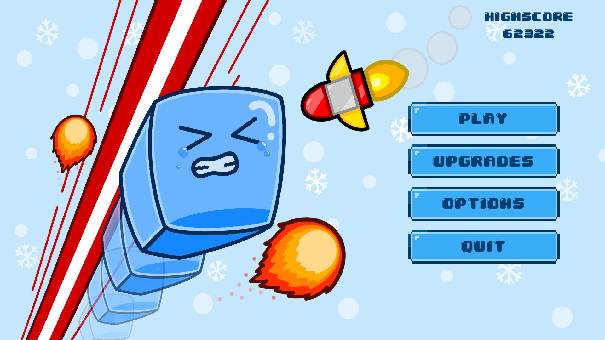
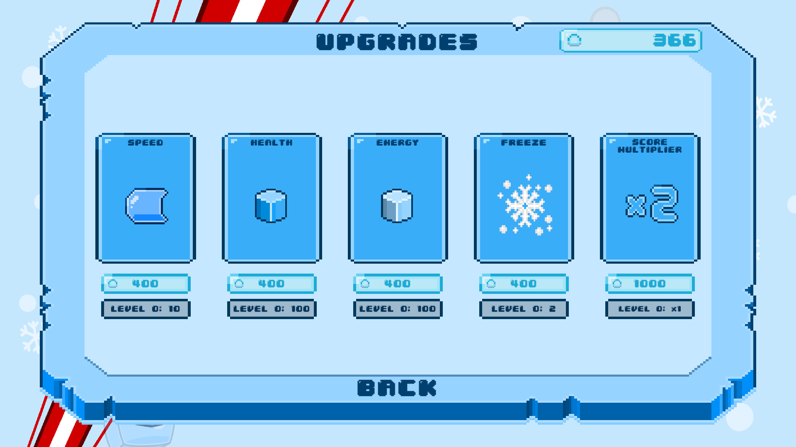
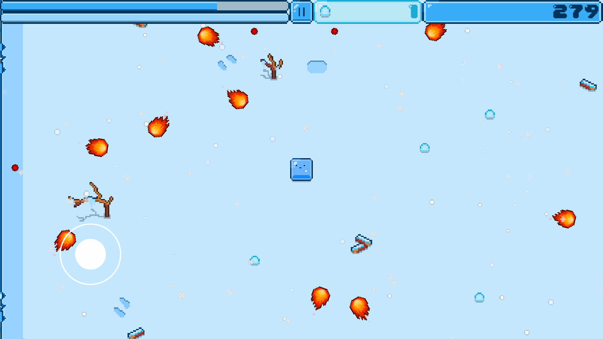
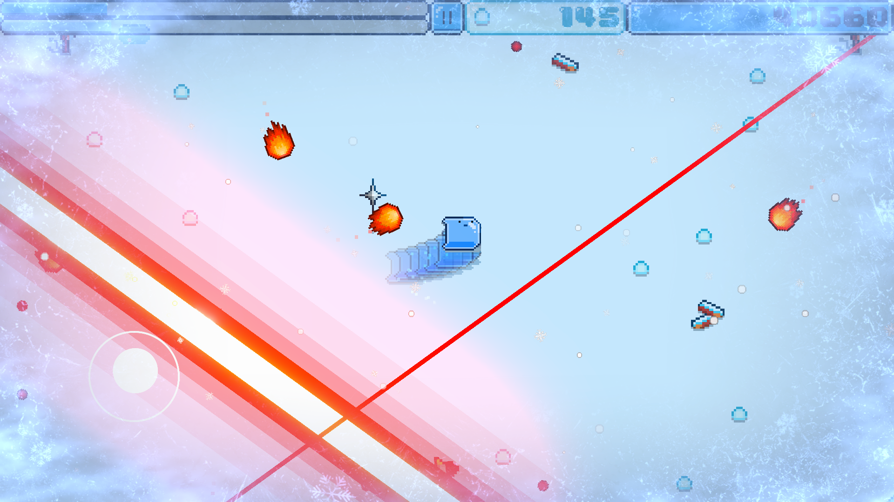
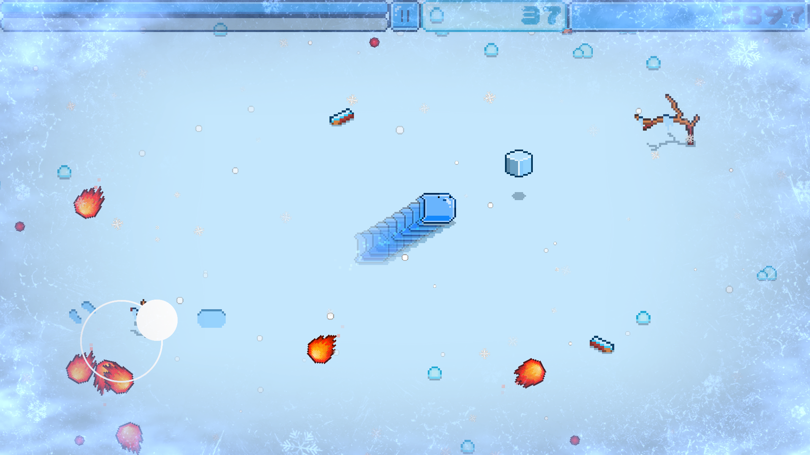
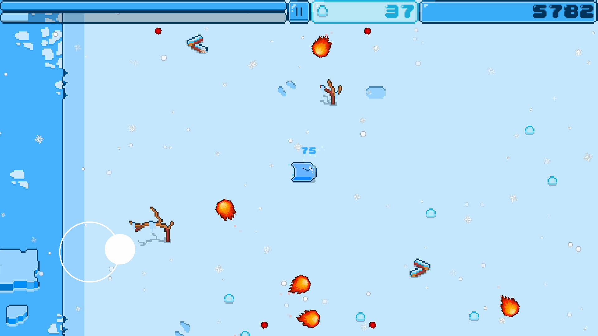

# Stay Cold

A solo-developed mobile arcade survival game built in Unity — original code, original pixel art, original design.

**[Play on itch.io](https://suhbae52.itch.io/stay-cold)**

---

## Overview

Stay Cold is a fast-paced 2D arcade survival game where the player controls an ice cube dodging an escalating barrage of projectiles across an iceberg arena. The game features a phase-based difficulty system, a time-manipulation mechanic, a snowball upgrade system, and full mobile/PC dual-input support.

Built entirely solo — gameplay systems, difficulty logic, UI, and all pixel art were designed and implemented from scratch.

---

## Technical Highlights

### Phase-Based Difficulty Scaling
The game progresses through 25 timed phases managed by a coroutine in `LevelManager.cs`. Each phase adjusts projectile spawn weights using a two-threshold probability system (`projectileT1`, `projectileT2`) to shift the ratio of fireballs, lasers, and homing missiles over time. Projectile speed, spawn frequency, and score multiplier also scale incrementally per phase.

```
Phase 1–5:   Fireballs only (100% / 0% / 0%)
Phase 6–10:  Lasers begin appearing (~90% / 10% / 0%)
Phase 11–15: Missiles introduced (~85% / 12% / 5%)
Phase 16–25: All three types fully active with increasing speed
```

### Time Manipulation (Slow Motion)
Slow motion is implemented by smoothly lerping `Time.timeScale` toward a target multiplier using `Time.unscaledDeltaTime` to keep the transition frame-rate independent. `Time.fixedDeltaTime` is corrected in sync to maintain stable physics during time scaling. Energy drains at a rate tied to unscaled time so the mechanic feels consistent regardless of the current time scale.

```csharp
Time.timeScale = Mathf.Lerp(Time.timeScale, 1f / timeSlowMultiplier, Time.unscaledDeltaTime * 7.5f);
Time.fixedDeltaTime = Time.timeScale * .02f;
```

### Octagon Boundary System
The iceberg arena is defined as an octagon via a set of 2D vertices. A point-in-polygon algorithm checks whether the player's desired position falls within bounds each `FixedUpdate`. If out of bounds, the closest point on the nearest octagon edge is computed via edge projection and used as the clamped position — keeping movement smooth against the boundary rather than hard-stopping.

### Circular Enemy Spawner Positioning
Projectile spawners (barrels) are positioned around the player in a circle using trigonometry. Each spawner's position is recalculated every frame relative to the player using:

```csharp
float angle = i * Mathf.PI * 2f / enemies.Length;
position = player.position + new Vector3(Mathf.Cos(angle) * radius, Mathf.Sin(angle) * radius);
```

This keeps spawners evenly distributed and always centered on the player as they move.

### Off-Screen Projectile Indicator
When a fireball is off-screen, a raycasting system calculates the direction from the projectile to the player and fires a `Physics2D.Raycast` to find where it intersects the visible boundary. An indicator is placed at that intersection point, giving the player a heads-up before the threat becomes visible.

### Coroutine-Driven Game Systems
Several game systems run as persistent coroutines:
- **ScoreUpdater** — smoothly increments the displayed score toward the real total
- **SnowBallUpdater** — animates the snowball counter independently
- **PhaseManager** — triggers phase transitions on a timed loop and propagates updates to all active barrels

### Persistent Data
Player stats (health, energy, speed, score multiplier, slow motion duration, high score, snowball currency) are saved and loaded via a `DataManager` singleton. Upgrades purchased between runs persist across sessions.

---

## Gameplay

- Survive as long as possible as your score climbs automatically
- Dodge fireballs, lasers, and homing missiles — difficulty escalates across 25 phases
- Manage **health** (lost on hit) and **energy** (consumed by slow motion)
- Collect items that spawn randomly across the arena:
  - **Ice** — Restores health
  - **Dry Ice** — Recharges energy
  - **Shockwave** — Clears all projectiles instantly
- Collect **snowballs** to purchase upgrades: health, energy, speed, slow motion duration, score multiplier

---

## Controls

### Mobile
- Joystick — Move the ice cube
- Right half of screen — Activate slow motion
- Fixed or floating joystick configurable in the options menu

### PC
- Mouse — Move the ice cube
- Spacebar — Activate slow motion
---

## Built With

### Engine & Language
- Unity (2D)
- C#

### User Interface
- TextMeshPro

### Physics & Input
- Unity Physics2D — collision, raycasting, rigidbody movement
- Variable Joystick Package — mobile input

### Data & Saving
- PlayerPrefs / DataManager — persistent save system

### Art
- Original pixel art — all designed and created from scratch

## Project Structure

```
Assets/
└── Scripts/
    ├── LevelManager.cs                 # Phase system, score, slow motion, and core game state
    ├── PlayerScript.cs                 # Movement, input, health/energy, and octagon boundary clamping
    ├── BarrelScript.cs                 # Projectile spawning and phase-based difficulty scaling
    ├── FireBall.cs                     # Fireball projectile behavior and off-screen indicator
    ├── Enemy.cs                        # Trigonometric circular spawner positioning
    ├── ItemSpawner.cs                  # Randomized item spawning with restricted area validation
    ├── ShopManager.cs                  # Upgrade shop logic with level-scaled pricing
    ├── DataManager.cs                  # Persistent singleton managing all player stats across sessions
    ├── SaveSystem.cs                   # Binary file serialization for saving and loading player data
    ├── PlayerData.cs                   # Serializable data model for save files
    ├── AudioManager.cs                 # Global audio system with dynamic pitch, volume, and fade control
    ├── FullScreenEffectController.cs   # URP post-processing for damage vignette and slow motion effects
    ├── CameraScript.cs                 # Camera shake and smooth zoom tied to slow motion state
    ├── CameraFollow.cs                 # Smooth lerp-based camera tracking
    ├── GhostEffect.cs                  # Trail ghost effect spawned during slow motion
    ├── AlphaChange.cs                  # Fade-out handler for ghost trail sprites
    ├── PlayerFace.cs                   # Animated face expressions reacting to game events
    ├── NumberIndicator.cs              # Floating damage and heal number pop-ups
    ├── SlowMotionButton.cs             # Dual input handler for mobile tap and keyboard spacebar
    ├── OptionsMenu.cs                  # Volume and joystick preference settings via PlayerPrefs
    ├── BorderWarningScript.cs          # Dynamic collider sizing for off-screen border indicators
    ├── MainMenu.cs                     # Main menu navigation and audio control
    ├── GameMenu.cs                     # In-game pause menu with restart and main menu navigation
    ├── GameOverMenu.cs                 # Game over screen with animated score and snowball tallying
    ├── HighScore.cs                    # Displays the persistent high score from DataManager
    ├── SnowBall.cs                     # Single snowball item collectible that awards score and currency
    ├── TenSnowBalls.cs                 # Rare 10x snowball item collectible with bonus score
    ├── DryIceEnergy.cs                 # Energy item with lifetime, blinking, and off-screen indicator
    ├── HomingProjectile.cs             # Homing missile projectile with proximity-triggered tracking and rotation
    ├── IceHealth.cs                    # Health item with lifetime, blinking, and off-screen indicator
    ├── Laser.cs                        # Laser beam projectile(?)
    ├── LaserBarrel.cs                  # Laser telegraph and beam sequence via coroutine
    ├── ShockWave.cs                    # Expanding shockwave that destroys all active projectiles
    └── ShockWaveItem.cs                # Shockwave pickup with off-screen indicator
```

## Screenshots






